# Travel Island

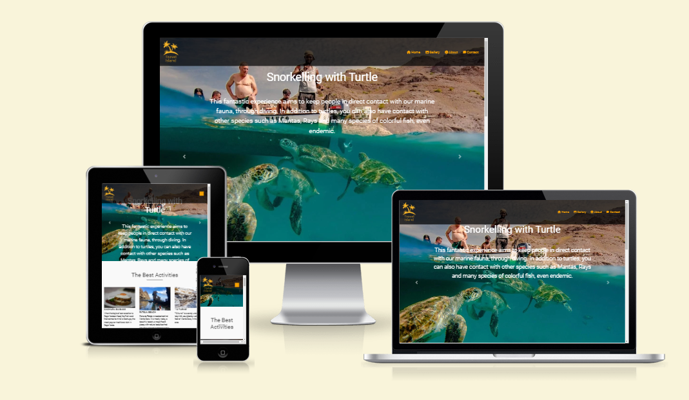

Travel Island is an online platform that aims to make known the services and tourist activities that visitors and lovers of the islands of Cape Verde will have the opportunity to do
during their travels.

The platform highlights the various areas of activity and service, from the typical foods of the islands, water activities, island tours, the best places to see the sunrise and sunset, the festive seasons during the year, the points considered most incredible of the islands and among others.

Platform's objective is to give greater visibility to Cape Verde, both internationally and nationally, bringing people closer to knowing more about the culture and the paradise that is the country and facilitating access to different services and activities. And, with that, boost the country's domestic tourism.

Visit the deployed website [here](https://joelinealves.github.io/Travel_Island/).

## Table of Contents

- [Travel Island](#travel-island)
  - [Table of Contents](#table-of-contents)
  - [User Experience (UX)](#user-experience-ux)
    - [Project Goals](#project-goals)
    - [User Stories](#user-stories)
    - [Color Scheme](#color-scheme)
    - [Typography](#typography)
    - [Wireframes](#wireframes)
  - [Features](#features)
    - [General](#general)
    - [Home Page](#home-page)
    - [About Page](#about-page)
    - [Contact Page](#contact-page)
    - [Gallery Page](#gallery-page)
  - [Technologies Used](#technologies-used)
    - [Languages Used](#languages-used)
    - [Frameworks, Libraries and Programs Used](#frameworks-libraries-and-programs-used)
  - [Testing](#testing)
    - [Testing User Stories](#testing-user-stories)
    - [Code Validation](#code-validation)
    - [Accessibility](#accessibility)
    - [Tools Testing](#tools-testing)
    - [Manual Testing](#manual-testing)
  - [Finished Product](#finished-product)
  - [Deployment](#deployment)
    - [GitHub Pages](#github-pages)
  - [Credits](#credits)
    - [Content](#content)
    - [Media](#media)
    - [Code](#code)
  - [Acknowledgements](#acknowledgements)

***

## User Experience (UX)

### Project Goals

The main objective of this project is to provide our target audience with an integrated and simplified user experience.
Our goal is to provide an easy-to-use application that meets user needs.

- To increase tourism, publicize the various services, activities and information about the islands.

- Provide the customer with useful information that can facilitate future interaction with the business.

- Give customers the opportunity to find out more and contact us to find out more about the activities and services available.

### User Stories

- As a user, I want to be able to navigate the website intuitively.

- As a user, I want to know more about the islands and read more about the activities and services available.

- As a user, I want to be able to read and learn more about Travel Island.

- As a user, I want to easily find the company's contact information.

- As a user, I want to be able to show my interest by sending a message to the page.

- As a user, I want to find social media links for the business.

- As a user, I want to be able to see the website gallery.

- As a user, I want to easily find the company's location.

### Color Scheme

The colors used on the website are white in different tones used for focusing effects, in some paragraphs and also as background-color (#fafafa, #f9f9f9, #fff), an orange color also in different tones in rgba format for the titles in the navbar, icons, paragraphs in the footer and in the contact form and also as background-color (rgba(255, 166, 0, 0.959), rgba(247, 185, 72, 0.959)), gray as background navbar and footer, also used in the form (#333, rgb(112, 110, 110)), the color black is used in some headins and paragraphs. These colors are chosen to attract more attention from the website user and also to favor the Travel Island logo, and also for good readability and user perception.

### Typography

The main font used on the site is Roboto, with Sans Serif as a fallback font if Roboto is not importing correctly. I decided to use just one font.

### Wireframes

[Figma](https://www.figma.com/) has been used to showcase the appearance of the site and display the placement of the different elements whitin the pages.

Page | Desktop Version | Mobile Version
--- | --- | ---
Home | 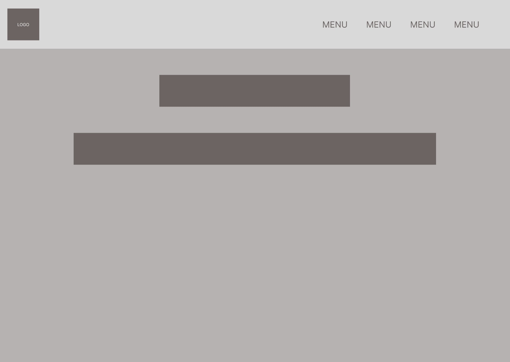 | 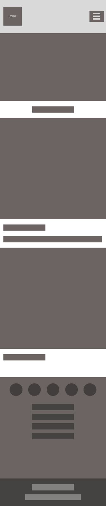
Activities | 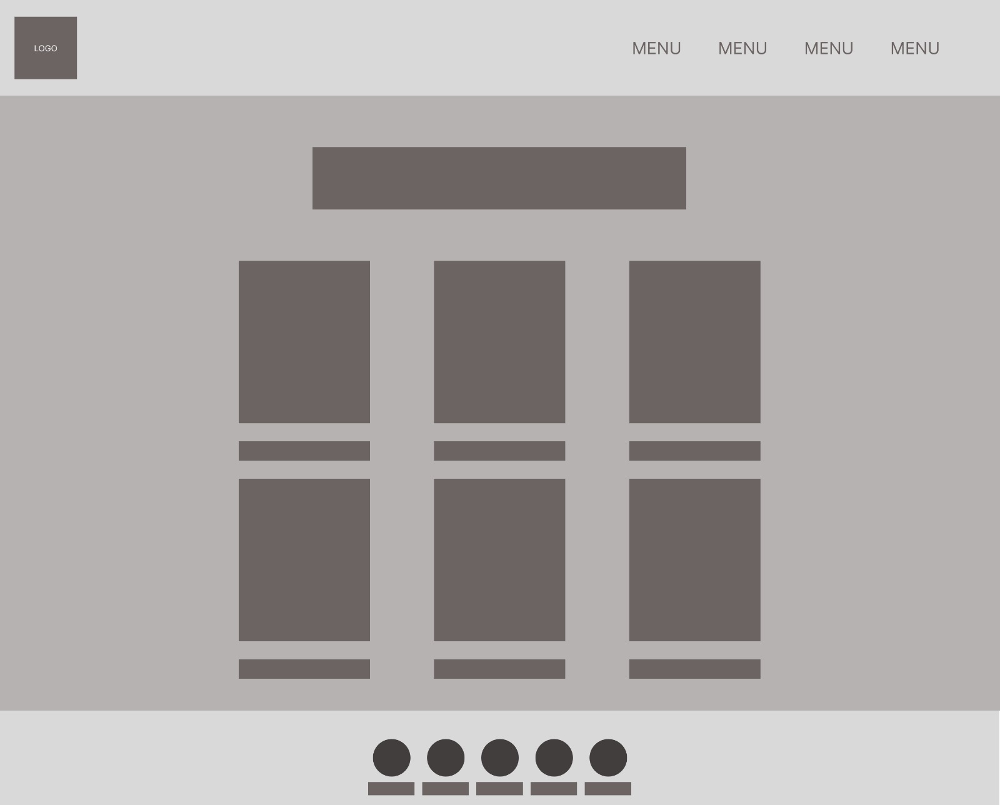 | 
About | 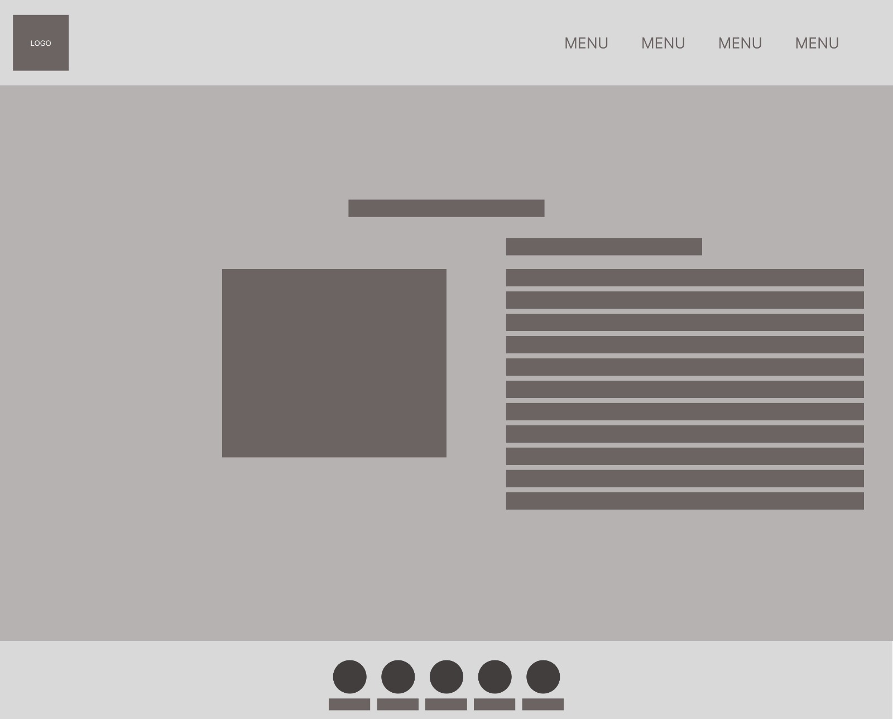 | 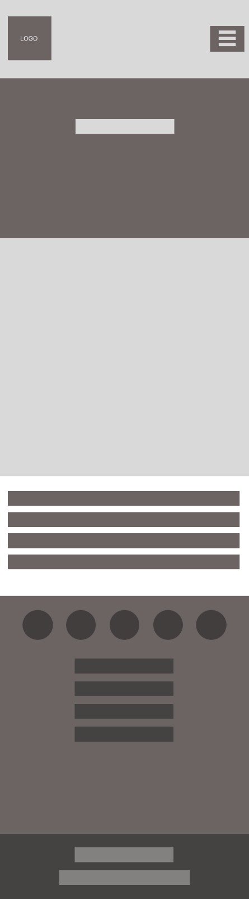
Gallery | 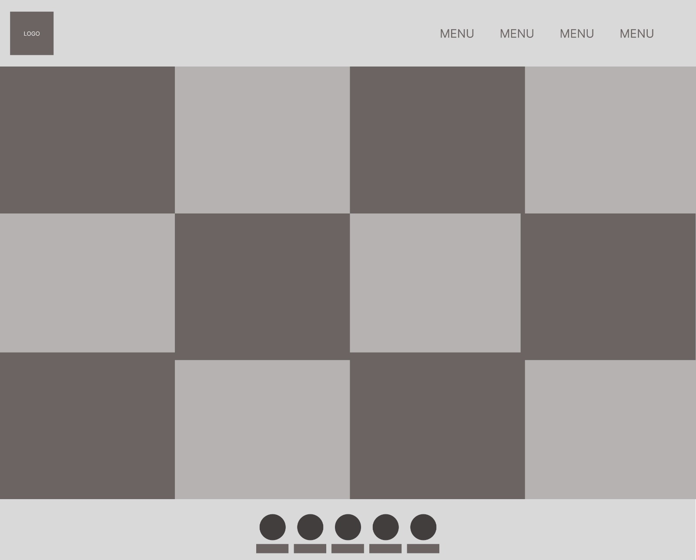 | 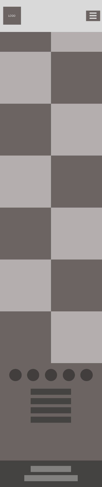
Contact | 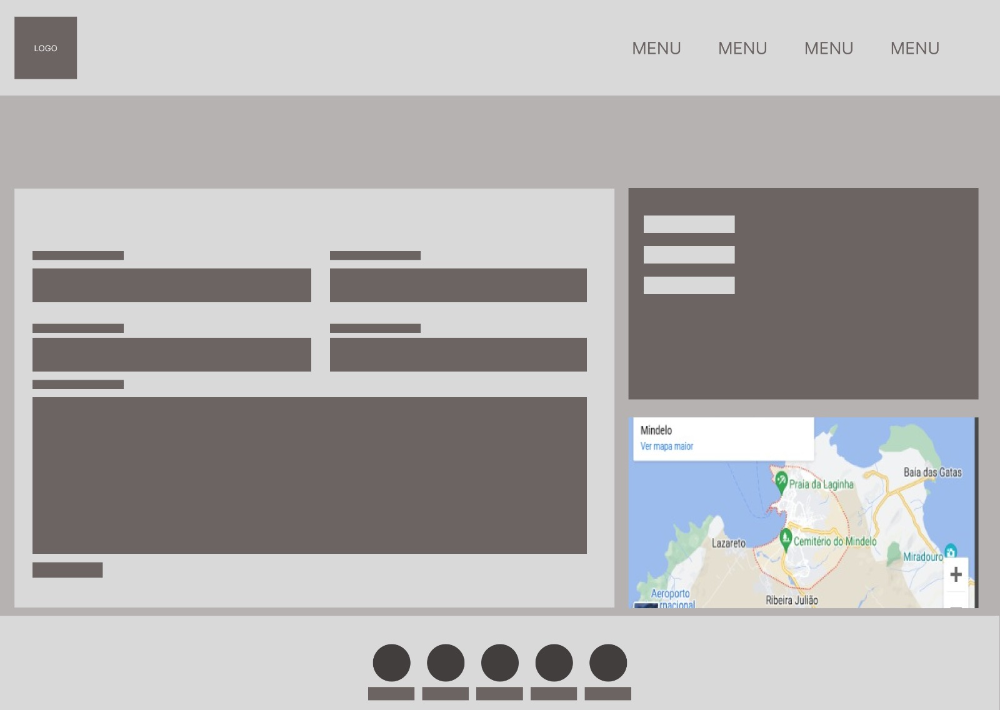 | 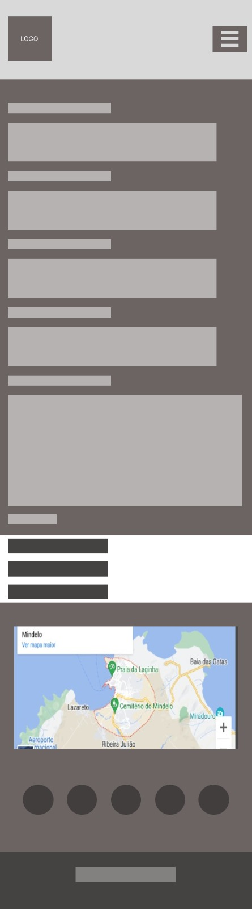

[Back to top ⇧](#travel-island)

## Features

### General

- Responsive design on all device sizes.

- Similar color scheme and design across all pages to structure, categorize, and present information attractively and effectively to customers.

- **Header**
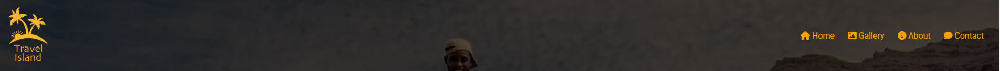

  - The header contains the Travel Island  logo and fully responsive navigation bar positioned across the top of the screen.

  - The Travel Island logo functions as a link to the landing page.

  - The navigation bar is identical in all pages and contains links to all pages to facilitate navigation across the site. It also has a hover effect that changes color to provide feedback to the customer for a better user experience.

- **Footer**

  - The footer includes the links to all pages and social media links to stay connected to the Travel Island.

### Home Page

- **Carousel Image**
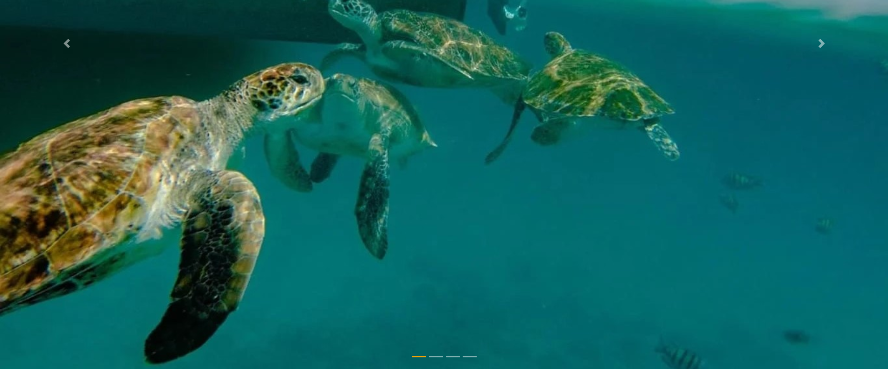
  
- Carousel with beautiful images and descriptions of the attractions of the Cape Verde islands.

- **Cards Image**
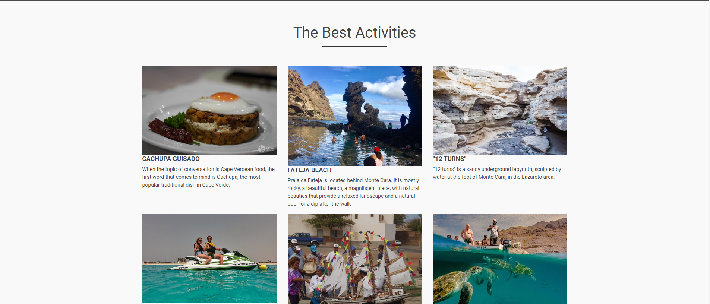
  
- Cards with Information about the best activities on the islands.

### About Page

- **About Travel Island**
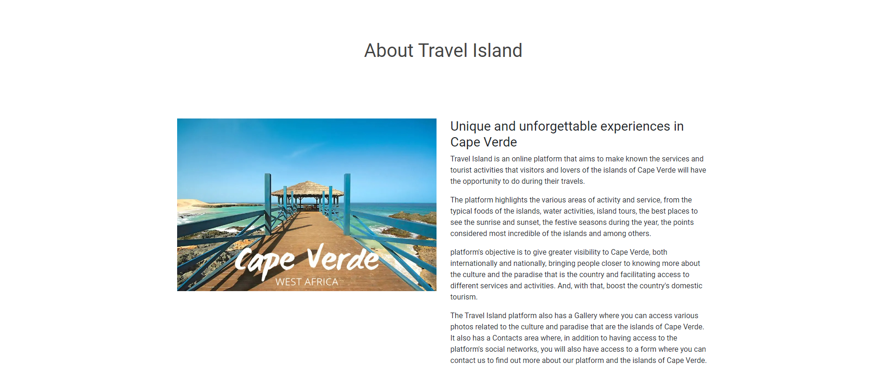

  - It contains text with information about what the purpose of Travel Island is and also an attractive image of Cape Verde.

### Contact Page

- **Get in Touch**
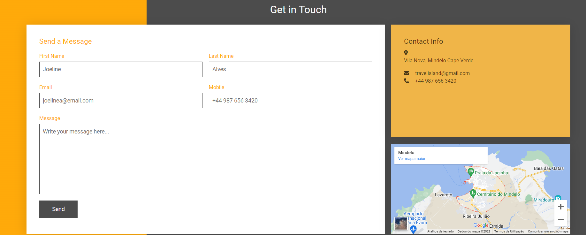

- It contains a form if you want to know more about the site, as well as contact details such as the company's physical address, email and telephone number, and it also contains a geographical map of Travel Island's location.

### Gallery Page

- **Gallery**
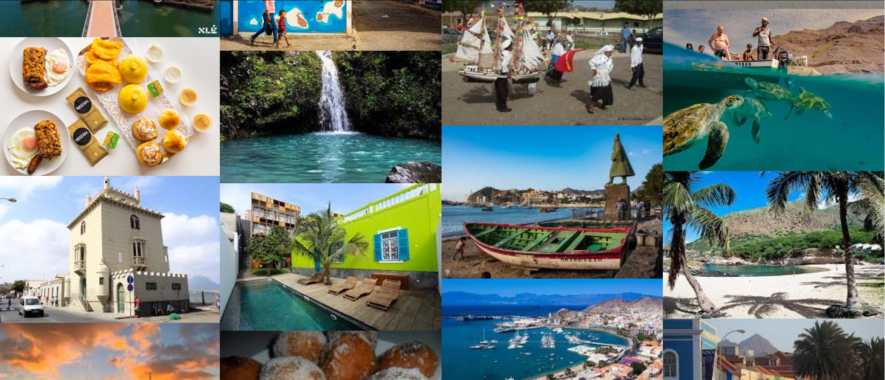

- The gallery page provides several photos of different places on the islands, from beaches, mountains, cities.

- Contains photos of different typical foods, festive festivities, such as the famous carnival.

- Contains photos of the various activities that can be done, such as water activities, sunsets, hiking.

- Contains a photo of the great singer known worldwide in music.

## Technologies Used

### Languages Used

- [HTML5](https://en.wikipedia.org/wiki/HTML5)
- [CSS3](https://en.wikipedia.org/wiki/CSS)

### Frameworks, Libraries and Programs Used

- [Google Fonts](https://fonts.google.com/)
  - Google Fonts was used to import the Roboto font into the style.css file. This font was used throughout the site.

- [Font Awesome](https://fontawesome.com/)
  - Font Awesome was used throughout all pages to add icons in order to create a better visual experience for UX purposes.

- [Codeanywhere](https://codeanywhere.com/)
  - Codeanywhere was used for writing code, committing, and then pushing to GitHub.

- [GitHub](https://github.com/)
  - GitHub was used to store the project after pushing.

- [Figma](https://www.figma.com/)
  - Figma was used to create the wireframes during the design phase of the project.

- [Am I Responsive?](http://ami.responsivedesign.is/#)
  - Am I Responsive was used in order to see responsive design throughout the process and to generate mockup imagery to be used.
  
- [Responsive Design Checker](https://www.responsivedesignchecker.com/)
  - Responsive Design Checker was used in the testing process to check responsiveness on various devices.

- [Chrome DevTools](https://developer.chrome.com/docs/devtools/)
  - Chrome DevTools was used during development process for code review and to test responsiveness.

- [W3C Markup Validator](https://validator.w3.org/)
  - W3C Markup Validator was used to validate the HTML code.

- [W3C CSS Validator](https://jigsaw.w3.org/css-validator/)
  - W3C CSS Validator was used to validate the CSS code.

[Back to top ⇧](#travel-island)

## Testing

### Testing User Stories

- As a user, I want to be able to navigate the website intuitively and learn more about the Travel Island and the activities and services offered.

  - The website offers a intuitive structure for the users to navigate and find the information they are looking for.

  - The navigation bar is clearly presented in all pages even in the footer for the users to find with ease and it is easily navigable.

- As a user, I want to be able to read more about the activities available.

  - Each card activities  contains useful information about the respective activity.

- As a user, i want to be able to know more about the Cape Verde island.
  
  - The gallery page provides several photos of different places, foods, festive festivities on the islands.

- As a user, I want to easily find the contact information for the Travel Island.

  - The Contact page contains a clear contact section with all necessary Travel Island contacts.

- As a user, I want to find social media links to the Travel Island.

  - The footer provides link to the social media channels.

- As a user, I want to be able to send a message directly from the website.

  - As a user, I want to easily find the Travel Island location.

- The Contact page contains a section with a Google map of the Travel Island geographical location.

### Code Validation

- The [W3C Markup Validator](https://validator.w3.org/) and [W3C CSS Validator](https://jigsaw.w3.org/css-validator/) services were used to validate all pages of the project in order to ensure there were no syntax errors.

  - W3C Markup Validation found an warnings related to comments made incorrectly in the HTML code. The error was corrected by correctly commenting the code.

  - The errors found by W3C Markup Validator were incorrectly assigned names in images, using space and capital letters. The warning has been fixed by correctly spelling the name of the images.

  - W3C CSS Validator found no errors or warnings on my CSS.

### Accessibility

- Used Lighthouse in Chrome DevTools to confirm that the colors and fonts being used in throughout the website are easy to read and accessible.

- Lighthouse reports

  - **Home Page**

    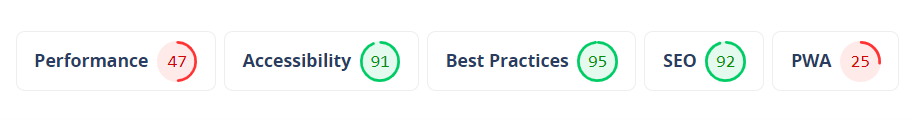

  - **Gallery Page**

    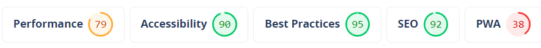

  - **About Page**

    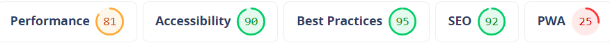

  - **Contact Page**

    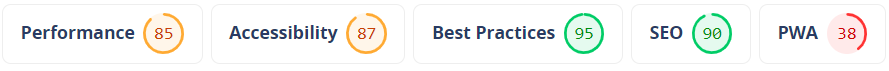

### Tools Testing

- [Chrome DevTools](https://developer.chrome.com/docs/devtools/)

  - Chrome DevTools was used during the development process to test, to explore and modify HTML elements and CSS styles used in the project.

- Responsiveness

  - [Am I Responsive?](http://ami.responsivedesign.is/#) was used to check responsiveness of the site pages across different devices.

  - [Responsive Design Checker](https://www.responsivedesignchecker.com/) was used to check responsiveness of the site pages on different screen sizes.

- [Chrome DevTools](https://developer.chrome.com/docs/devtools/) Chrome DevTools was used to test responsiveness in different screen sizes during the development process.
  
### Manual Testing

- Device compatibility

  - The website has been tested on multiple devices, including:

    - **iPhone SE"**

        No appearance, responsiveness nor functionality issues.

    - **iPhone XR**

        No appearance, responsiveness nor functionality issues.

    - **iPad Air**

        No appearance, responsiveness nor functionality issues.

    - **iPad Mini**

        No appearance, responsiveness nor functionality issues.

    - **Nest Hub Max**

        No appearance, responsiveness nor functionality issues.

- Common Elements Testing

  - All Pages

    - **Header**

      - Clicking on the main logo will bring the user back to the Home page.

    - **Navigation Bar**

      - Hovering on the different navigation bar's links will trigger hover effect, highlighting the link for the user.

      - Clicking on the navigation bar's links will bring the users to the specified page.

    - **Footer**

      - Clicking on the social media links will open the specific website on a new tab.
  
      - Clicking on the links of the pages will bring the users to the specified page.

  - About Page

    - Clicking on the About page will bring the user to the About page.

  - Gallery  Page

    - Clicking on the Gallery page will bring the user to the Gallery page.
  
  - Contact Page
  
    - Clicking on the Contact page will bring the user to the Contact page.

    - When filling out  the Get in touch form, the user have to press the send message to submit the form.

    - Clicking and dragging on the map in the info  section will move the area shown on the map.

    - Clicking the plus and minus buttons changes the zoom of the map.

[Back to top ⇧](#travel-island)

## Finished Product

Page | Desktop version | Mobile version
--- | --- | ---
Index |  | 
Treatments |  | 
Book Now |  | 
404 Error |  | 

[Back to top ⇧](#travel-island)

## Deployment

- This website was developed using [Codeanywhere](https://codeanywhere.com/), which was then committed and pushed to GitHub using the codeanywhere terminal.

### GitHub Pages

- Here are the steps to deploy this website to GitHub Pages from its GitHub repository:

    1. Log in to GitHub and locate the [GitHub Repository](https://github.com/).

    2. At the top of the Repository, locate the Settings button on the menu.

        - Alternatively click [here](https://raw.githubusercontent.com/) for a GIF demostration of the process.

    3. Scroll down the Settings page until you locate the Pages section.

    4. Under Source, click the dropdown called None and select Master Branch.

    5. The page will refresh automatically and generate a link to your website.

[Back to top ⇧](#travel-island)

## Credits

### Content

- All content was written by the developer.

### Media

- [Pexels](https://www.pexels.com/)

  - Main image: "Waterfalls in the Middle of Green Trees" by Austin Tsai.
  - 404 Error Page image: Taken by Artem Beliaikin.

- [Unsplash](https://unsplash.com/)

  - About Us image: "Pristine water lily" by Jay Castor.
  - Massage image: "Beautiful Woman Getting Stones Massage in Spa Salon" by Engin Akyurt.
  - Facial image: Taken by Raphael Lovaski.
  - Pedicure image: "Warm bath before treatment" by Rune Enstad.
  - Book Now image: Taken by Firos Nv.

### Code

- [Stack Overflow](https://stackoverflow.com/) and [W3Schools](https://www.w3schools.com/) were consulted on a regular basis for inspiration and sometimes to be able to better understand the code being implement.

[Back to top ⇧](#travel-island)

## Acknowledgements

- My Brother, for him unconditional love, help and support in all aspects of life to make possible for me to work on this project.

- My family, for their valuable opinions and and critic during the design and development process.

- To my mentors, Marcel and Spencer, for their invaluable feedback and guidance.

- My Tutor, Rachel, for the all help and support.

- Codeanywhere support, to help resolve issues encountered.

- Code Institute and its amazing Slack community for their support and providing me with the necessary knowledge to complete this project.

[Back to top ⇧](#travel-island)
